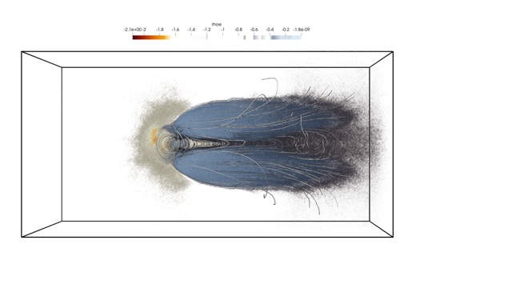

iPIC3D
======

Overview
--------

iPIC3D [1]_ [2]_ is a massively parallel, moment-implicit Particle-in-Cell (PIC) code for large-scale kinetic plasma simulations, particularly targeting global magnetospheric dynamics. Developed in C++ with hybrid MPI/OpenMP parallelism, it is designed for exascale platforms and optimized for both CPU and GPU architectures including AMD MI300A and NVIDIA Grace Hopper.

Developer Team: Stefano Markidis, Ivy Peng, Andong Hu, Luca Pennati (KTH Royal Institute of Technology)

+------------------------+--------------------------------------------------------------------------------+
| Additional information | `iPIC3D <https://github.com/iPIC3D>`_ developed by KTH Royal Institute of      |
|                        | Technology and collaborators                                                   |
+------------------------+--------------------------------------------------------------------------------+
| WG Point of Contact    | Stefano Markidis                                                               |
+------------------------+--------------------------------------------------------------------------------+
| Current code version   | 1.0.0                                                                          |
+------------------------+--------------------------------------------------------------------------------+
| code/repository        | `GitHub <https://github.com/iPIC3D>`_                                          |
+------------------------+--------------------------------------------------------------------------------+
| Legal Code License     | Apache License 2.0                                                             |
+------------------------+--------------------------------------------------------------------------------+
| Software code          | C++                                                                            |
| languages and tools    | Python, ADIOS2, HIP/CUDA, MPI, OpenMP                                          |
+------------------------+--------------------------------------------------------------------------------+

Capabilities
------------

+--------------------------+----------------------------------------------------------------+
| Feature                  | Description                                                    |
+==========================+================================================================+
| Fully Kinetic            | Electrons and ions treated kinetically                         |
+--------------------------+----------------------------------------------------------------+
| Moment-Implicit Scheme   | Enables large time steps and grid spacing without instability  |
+--------------------------+----------------------------------------------------------------+
| GPU/CPU Hybrid Workflow  | Accelerated phases with CUDA/HIP and concurrent execution      |
+--------------------------+----------------------------------------------------------------+
| Particle Control         | Dynamic splitting/coalescence for load balancing               |
+--------------------------+----------------------------------------------------------------+
| In-Situ Compression      | Gaussian Mixture Model (GMM) based physics-aware compression   |
+--------------------------+----------------------------------------------------------------+
| Integrated Analysis      | Change-point detection and entropy-based anomaly identification|
+--------------------------+----------------------------------------------------------------+

Numerical Methods
-----------------

iPIC3D uses a moment-implicit Particle-in-Cell formulation. The particle pusher is based on a relativistic predictor-corrector scheme. The field solver integrates Maxwell's equations with a matrix-free GMRes solver, using fluid moments interpolated from particles. The scheme enables implicit time integration with selective damping of unresolved high-frequency modes, improving numerical stability and efficiency over explicit methods.

Use Cases
---------

- Magnetospheric simulations (Earth, Ganymede, Mercury)
- Magnetic reconnection events
- Kinetic-scale space weather modeling

Data Availability
-----------------

Upon request.

Simulations-on-Demand
---------------------

No

References
----------

.. [1] S. Markidis, G. Lapenta, Rizwan-uddin "Multi-scale simulations of plasma with iPIC3D," Mathematics and Computers in Simulation, 80(7), 1509--1519, 2010. `<https://doi.org/10.1016/j.matcom.2009.08.038>`_.
.. [2] I.B. Peng et al., "The formation of a magnetosphere with implicit particle-in-cell simulations," Procedia Computer Science, 51, 1178--1187, 2015. `<https://doi.org/10.1016/j.procs.2015.05.288>`_.
